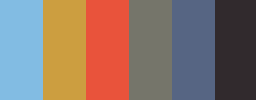
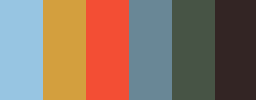

# atcq

[](http://github.com/badges/stability-badges)

An implementation of Ant-Tree Color Quantization (ATCQ), described by Pérez-Delgado in various papers including: [[1]](https://ieeexplore.ieee.org/document/8815696), [[2]](https://www.sciencedirect.com/science/article/abs/pii/S1568494615005086).


>

Resulting 16 color palette, sorted and weighted by size:


With post-processing the data, we can further reduce to 6 disparate colors:


**NOTE:** This library is not yet fully documented or tested yet, and probably not yet suited for production.

## Differences from other Algorithms

The ATCQ algorithm runs iteratively, which means the colours it outputs get progressively more representative of the input pixels as the algorithm runs. It may also produce different results each time it runs, as it uses randomness to decide on certain operations while it runs.

This is a clustering-based algorithm, unlike many other popular quantization algorithms, which tend to be splitting-based.

According to the research papers by Pérez-Delgado:

> This method was compared to other well-known color quantization methods, obtaining better images than Octree, Median-cut and Variance-based methods.

This competes with Xiaolin Wu's "Greedy orthogonal bi-partitioning method" (GOBP) in regard to mean squared error, sometimes producing better results, and there are various ways to improve the ATCQ and combine it with the ideas of GOBP to get the 'best of both worlds' (as in [[1]](https://ieeexplore.ieee.org/document/8815696)).

However, the bare-bones ATCQ algorithm is also very slow and memory-intensive, ideally suited for situations where:

- You are dealing with a small input image, e.g. 512x512px
- You are dealing with a small output palette, e.g. 1-256 colours
- It is acceptable to have the algorithm run iteratively, i.e. in the background
- You want the weight of each colour in the reduced palette
- You want a little more control and flexibility over the quantization than what some other algorithms offer

I am using it for small color palette generation, see [Comparisons](#Comparisons).

If you are just interested in a simple quantizer, you may want to check out [image-q](https://github.com/ibezkrovnyi/image-quantization) or [quantize](https://www.npmjs.com/package/quantize), which are both fast and suitable for most situations.

## Quick Start

```js
const ATCQ = require('atcq');

const pixels = /* ... rgb pixels ... */
const palette = ATCQ.quantizeSync(pixels, {
  maxColors: 32
});

// array of 32 quantized RGB colors
console.log(palette);
```

Here `pixels` can be a flat RGBA array, an array of `[ r, g, b ]` pixels, or an ImageData object.

## Async Example

Or, an async example, that uses an interval to reduce blocking the thread:

```js
const ATCQ = require('atcq');

(async () => {
  const pixels = /* ... rgb pixels ... */
  const palette = await ATCQ.quantizeAsync(pixels, {
    maxColors: 32,
    // Max number of pixels to process in a single step
    windowSize: 1024 * 50
  });

  // array of 32 quantized RGB colors
  console.log(palette);
})();
```

## Weighted Palettes

A more advanced example, producing a weighted and sorted palette, plus a further reduced 'disparate' palette.

```js
const actq = ATCQ({
  maxColors: 32,
  progress: (p) => console.log('Progress:', p)
});

// add data into system
actq.addData(pixels);

(async () => {
  // run quantizer
  // while its running you can visualize the palettes etc...
  await actq.quantizeAsync();

  const palette = actq.getWeightedPalette();

  console.log(palette[0]);
  // { color: [ r, g, b ], weight: N }

  // You can get a 'disparate' palette like so:
  const minColors = 5;
  const bestColors = actq.getWeightedPalette(minColors);
})();
```

## Distance Functions

The linked papers use Euclidean distance, but I have been finding good results with CIE94 Textiles & Graphic Arts functions, and with CIE2000 (although it is much slower). You can find these functions in the [image-q](https://github.com/ibezkrovnyi/image-quantization) module, I've also copied a JS version of them from `image-q` to the `demo/utils` folder.

## Sorting the input data

The paper suggests sorting the pixels by Increasing Average Similarity or Decreasing Average Similarity, but this library does not yet handle this. If you are interested in helping, please open an issue.

## Post-Processing

My implementation here adds an additional feature: further palette reduction by cluster disparity. The goal of this is to produce a palette of count `targetColors` with *disparate* colors, by iteratively trimming away very close colours (deleting the least-weighted color) until you end up with the target count.

If you pass a number into `atcq.getWeightedPalette(n)` function that is smaller than the `maxColors` option, it will try to reduce the number of colors using the following algorithm:

```
palettes = [ ...initialPalettes ]
while palettes.length > targetColors:
  links = getMinimumSpanningTree(palettes)
  sort links by decreasing distance
  while links.length > 0 and palettes.length > targetColors:
    { fromColor, toColor } = links.pop()
    if fromColor.weight < toColor.weight:
      palettes.delete(fromColor)
    else
      palettes.delete(toColor)
```

I'm not sure if there is a better and more optimal approach here (feel free to open an issue to discuss), but it is producing nice palettes for my needs.

## Comparisons

Taking the baboon image and comparing it to various algorithms in the `image-q` module. The weighting and sorting is normalized for easier comparisons.

  
<sup>*ATCQ, CIEDE2000, α0.75, with disconnects, max 64 colors, target 6 colors*</sup>

  
<sup>*ATCQ, CIEDE2000, α0.2, with disconnects, max 64 colors, target 6 colors*</sup>

  
<sup>*WuQuant, CIEDE2000, max 6 colors*</sup>

  
<sup>*RGBQuant, CIEDE2000, max 6 colors*</sup>

  
<sup>*NeuQuant, CIEDE2000, max 6 colors*</sup>

See other outputs in the [./images](./images) direcotry.

## License

MIT, see [LICENSE.md](http://github.com/mattdesl/atcq/blob/master/LICENSE.md) for details.
